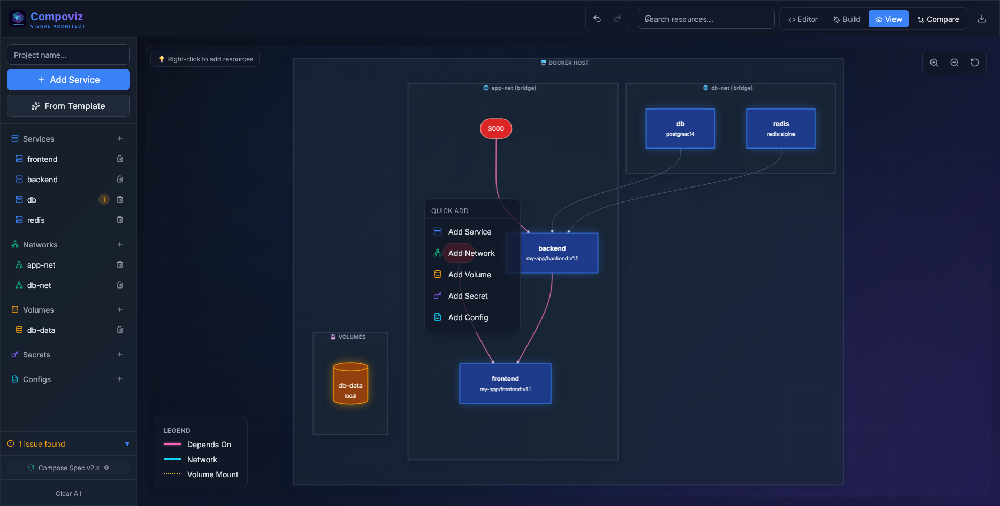

<p align="center">
  <a href="https://compoviz.pro">
    
  </a>
</p>
</p>

<h1 align="center">🐳 Docker Compose Architect (Compoviz)</h1>

<h3 align="center">
  <a href="https://compoviz.pro">Live Demo</a> |
  <a href="#-docker-deployment">Self-Host</a> |
  <a href="#-contributing">Contributing</a>
</h3>

<p align="center">
  <strong>An open source visual Docker Compose architect.</strong><br/>
  Transform YAML into interactive architecture diagrams.
</p>

<p align="center">
  <a href="https://github.com/adavesik/compoviz/blob/main/LICENSE">
    
  </a>
  <a href="https://github.com/adavesik/compoviz/stargazers">
    
  </a>
  <a href="https://github.com/adavesik/compoviz/issues">
    
  </a>
</p>

<br />

<p align="center">
  
</p>

<br />

---

## ✨ Key Features

### 🎨 Visual Architecture Mapping
*   **Pro-Grade Diagrams**: Automatically generates professional-grade architecture diagrams using an enhanced Mermaid.js engine.
*   **Logical Grouping**: Services are visually grouped by their **Docker Networks**.
*   **Edge Intelligence**: `depends_on` conditions (`healthy`, `started`) are visualized as labeled paths.
*   **Infrastructure Insights**: Visualizes host path mounts, named volumes, secrets, and configs at a glance.

### 🔍 Multi-Project Comparison
*   **Collision Detection**: Load up to 3 different `docker-compose.yml` files simultaneously.
*   **Conflict Analysis**: Real-time detection of port collisions, duplicate container names, and shared host volumes.
*   **Cross-Project Visualization**: See how distinct projects interact via shared networks or shared infrastructure.

### 🛠️ Robust Service Editor
*   **Spec-Compliant**: Built for the modern [Compose Specification](https://compose-spec.io/) (no more obsolete `version: '3.8'`).
*   **Smart Templates**: Instantly spin up standardized configurations for Redis, PostgreSQL, Nginx, MongoDB, and more.
*   **Field Validation**: Real-time warnings for missing images, undefined network references, and duplicate resource names.
*   **Rich Controls**: Full support for environment variables, `.env` files, healthchecks, entrypoints, and user permissions.

### ⌨️ Developer Experience
*   **Undo/Redo**: Full history management with `Ctrl+Z` / `Ctrl+Y` shortcuts.
*   **Modern Dark UI**: A sleek dark mode interface designed for maximum focus.
*   **Instant Export**: Export clean, optimized YAML ready for production.

---

## 🚀 Getting Started

### Prerequisites
*   [Node.js](https://nodejs.org/) (v18 or higher)
*   [npm](https://www.npmjs.com/)

### Installation

1. Clone the repository:
   ```bash
   git clone https://github.com/adavesik/compoviz.git
   cd compoviz
   ```

2. Install dependencies:
   ```bash
   npm install
   ```

3. Start the development server:
   ```bash
   npm run dev
   ```

4. Open your browser and navigate to `http://localhost:5173`.

---

## 🐳 Docker Deployment

The easiest way to run Compoviz is with Docker. No Node.js required!

### Using Docker Compose (Recommended)

```bash
# Clone the repository
git clone https://github.com/adavesik/compoviz.git
cd compoviz

# Build and run
docker compose up -d

# Access the app at http://localhost:8080
```

### Using Docker CLI

```bash
# Build the image
docker build -t compoviz .

# Run the container
docker run -d -p 8080:80 --name compoviz compoviz

# Access the app at http://localhost:8080
```

### Using Pre-built Image (Coming Soon)

```bash
docker run -d -p 8080:80 ghcr.io/adavesik/compoviz:latest
```

---

## 🛠️ Tech Stack

*   **Frontend**: React + Vite
*   **Styling**: Tailwind CSS (Custom Dark Theme)
*   **Diagrams**: Mermaid.js (Enhanced)
*   **Logic**: Custom hooks for history (`useHistory`) and state (`useCompose`, `useMultiProject`)
*   **YAML Parsing**: js-yaml

---

## 🤝 Contributing

Contributions are what make the open source community such an amazing place to learn, inspire, and create. Any contributions you make are **greatly appreciated**.

1. Fork the Project
2. Create your Feature Branch (`git checkout -b feature/AmazingFeature`)
3. Commit your Changes (`git commit -m 'Add some AmazingFeature'`)
4. Push to the Branch (`git push origin feature/AmazingFeature`)
5. Open a Pull Request

---

## 📜 License

Distributed under the MIT License. See `LICENSE` for more information.

---

<p align="center">
  Built with ❤️ for the Docker Community
</p>
